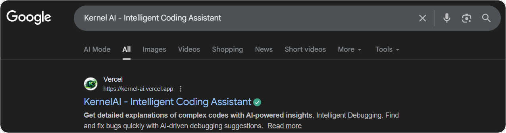
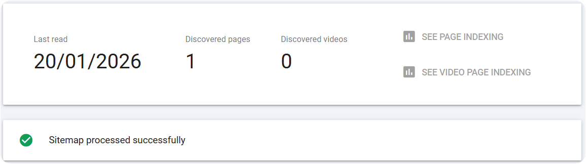
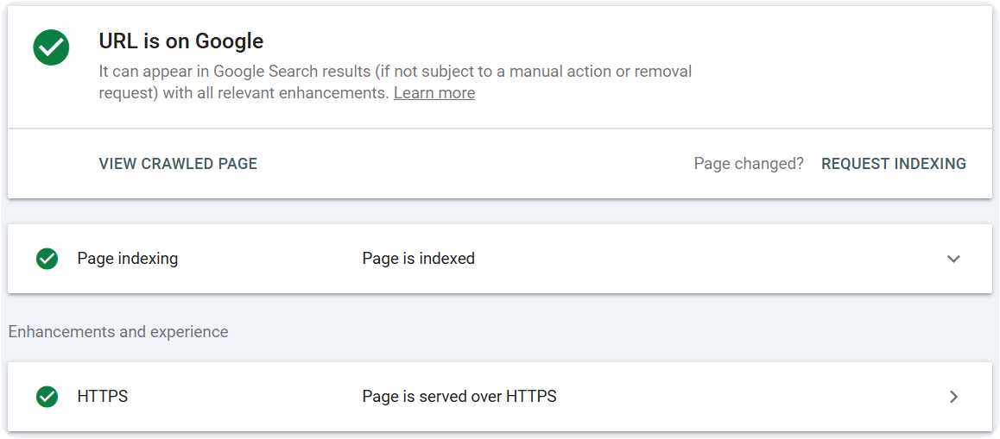
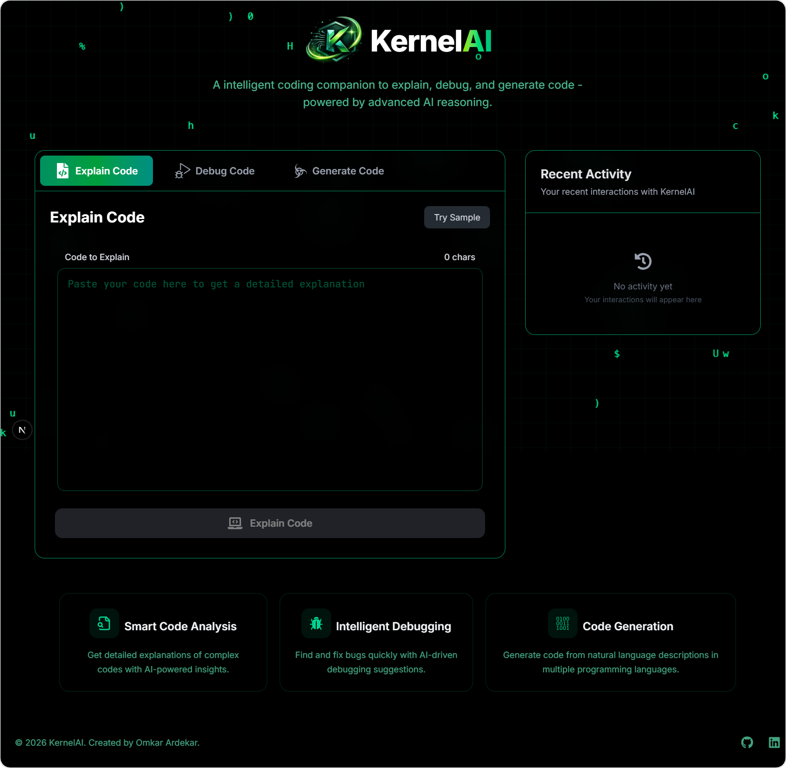
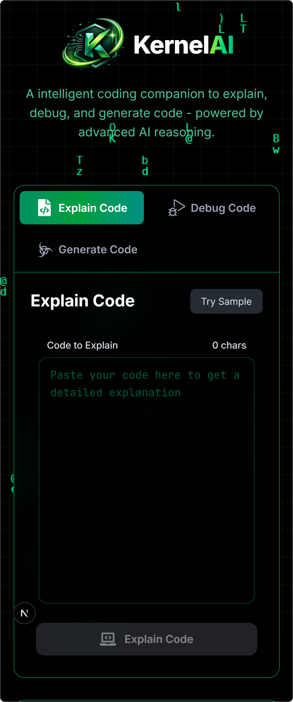
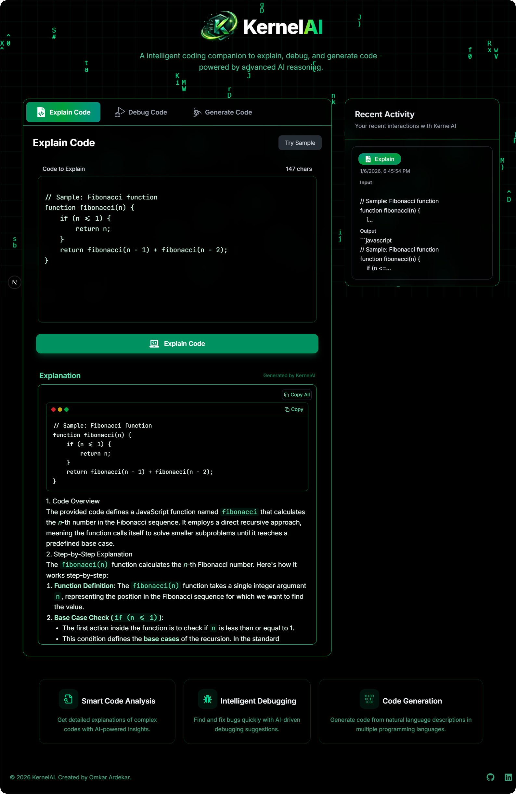

<h1>&nbsp;KernelAI</h1>

<div>
  
  
  
  
  
  
  
  
  
  
  
  
</div>

## KernelAI - Intelligent Coding Assistant

### KernelAI is an advanced AI-powered coding assistant designed to enhance developer productivity by providing intelligent code explanations, debugging assistance, and automated code generation.

### Built with a strong emphasis on clean architecture and developer experience, KernelAI delivers structured, well-formatted outputs using Markdown rendering, terminal-style code blocks with copy support, and readable explanations instead of raw text dumps. The platform features a fully responsive interface with smooth micro-animations, fast typewriter-style output rendering, intelligent language selection, and interaction history tracking—ensuring clarity, usability, and a production-grade experience aligned with modern industry standards.

<h2>
<a href="https://kernel-ai.vercel.app/" target="_blank" rel="noopener noreferrer">
&nbsp;KernelAI Live: https://kernel-ai.vercel.app
</a>
</h2>

<h2>
<a href="https://www.youtube.com/watch?v=paz9vs8QPfk" target="_blank" rel="noopener noreferrer">
<p>📽️ KernelAI Preview Video - Click here to watch the full video on YouTube
</p>
</a>
<p>

</p>
</h2>

<h2 id="seo-result">
<a href="https://www.google.com/search?q=site:kernel-ai.vercel.app" target="_blank" rel="noopener noreferrer">
<p>🔍 SEO Result - Click here to see</p>
<p></p>
<p></p>
<p></p>
</a>
</h2>

## ✨ Core Features

- **Code Explanation**
- **Code Debugging**
- **Code Generation**
- **Intelligent Language Selection**
- **Interactive History Tracking**
- **Structured & Formatted Output Rendering**
- **Rich Code Blocks with Copy Support and Markdown-Aware AI Output (Headings, Lists, Tables, Code)**
- **Fast Typewriter-Style Output Animation**
- **Smooth UI Animations (Framer Motion)**
- **Fully Responsive Design**
- **Modern Dark UI with Glassmorphism Theme**
- **Real-Time Toast Notifications**
- **Context-Aware AI Prompts & Sample Inputs for Quick Testing**
- **Client-Side Safe API Handling**

## 💻 Technologies Used

| **Technology**                    | Category                   | Purpose                                                       |
| --------------------------------- | -------------------------- | ------------------------------------------------------------- |
| **Next.js (App Router)**          | Frontend Framework         | Full-stack React framework for routing, SSR, and API handling |
| **React 19**                      | UI Library                 | Component-based user interface development                    |
| **Next.js API Routes**            | Backend APIs               | Secure server-side AI request handling                        |
| **Tailwind CSS 4**                | Styling and Responsiveness | Utility-first styling with a modern, responsive design system |
| **Framer Motion**                 | Animations                 | Smooth, performant UI animations and transitions              |
| **React Markdown**                | Markdown Rendering         | Structured rendering of AI-generated output                   |
| **Remark GFM**                    | Markdown Extensions        | GitHub-Flavored Markdown support (tables, lists, code blocks) |
| **React Hot Toast**               | Notifications              | Real-time toast notifications and user feedback               |
| **Google Generative AI (Gemini)** | AI Integration             | Code generation, explanation, and debugging                   |
| **TypeScript**                    | Type Safety                | Static typing and a safer, maintainable codebase              |
| **React Icons**                   | Icons                      | Consistent, scalable icon system                              |
| **Vercel**                        | Deployment & Hosting       | Fast, global deployment with optimized performance            |

## User Interface Overview

<table width="100%">
  <tr>
    <td width="50%">
      
    </td>
    <td width="50%" rowspan="2">
      
    </td>
  </tr>
  <tr>
    <td>
      
    </td>
  </tr>
</table>

## Installation

1. Clone the repository

```bash
git clone https://github.com/OmkarArdekar12/KernelAI.git
cd KernelAI
```

2. Install dependencies

```bash
npm install
```

3. Set up environment variables

- Create a `.env.local` file in the root directory and add your Gemini API key

```
GEMINI_API_KEY=your_api_key
```

4. Run the server

```bash
npm run dev
```

## Author 👨‍💻

### Omkar Ardekar 💻

[](https://www.linkedin.com/in/omkarardekar09)

---

<!-- KernelAI is an advanced AI-powered coding assistant designed to enhance developer productivity by providing intelligent code explanations, debugging assistance, and automated code generation. Built with a strong emphasis on clean architecture and developer experience, KernelAI delivers structured, well-formatted outputs using Markdown rendering, terminal-style code blocks with copy support, and readable explanations instead of raw text dumps. The platform features a fully responsive interface with smooth micro-animations, fast typewriter-style output rendering, intelligent language selection, and interaction history tracking—ensuring clarity, usability, and a production-grade experience aligned with modern industry standards. -->
